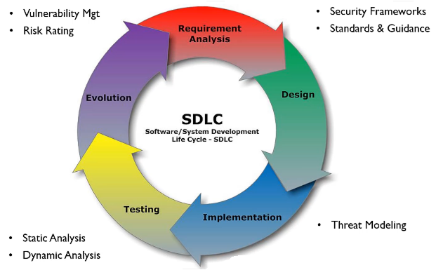
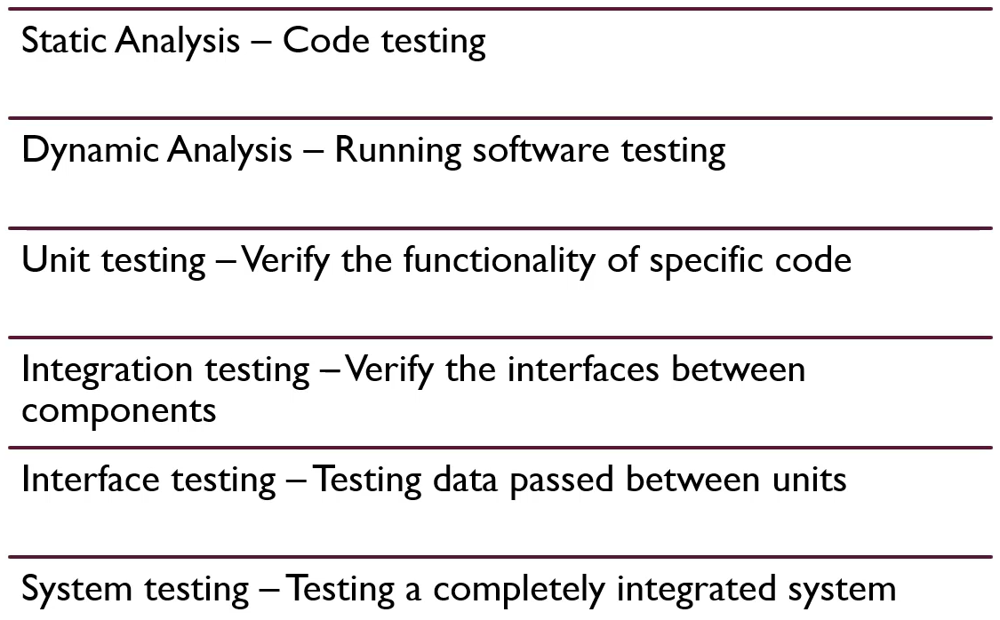
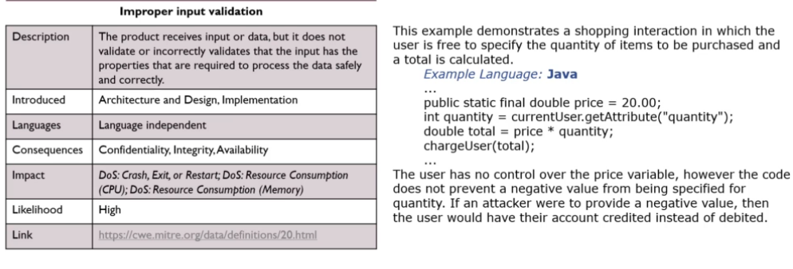
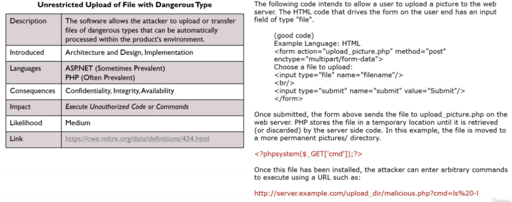
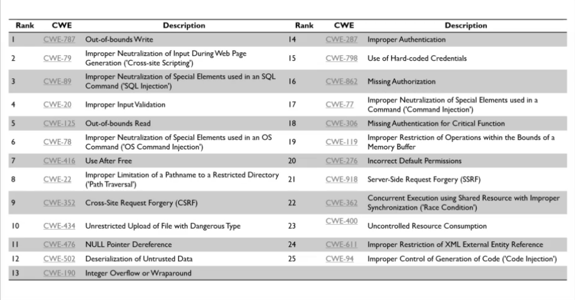
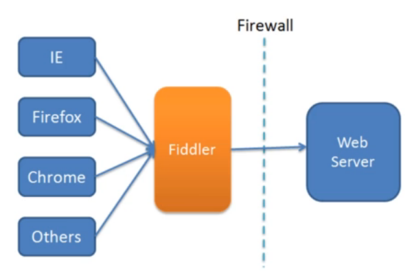
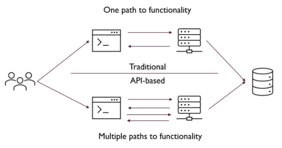

# Contents

# Introduction to Application Security

### Software Developmnt Life Cycle (SDLC)

### SDLC - Designing

- Describe features and operations
  - Screen layout
  - Business rules
  - Process diagrams
  - Pseudo code and documentation
- Prototype work
- Detailed design
  - Technology choices
  - System architecture

### SDLC Goals

### Definition of Security

- Security is anything you do to protect an asset that is vulnerable to some attack, failure or error.
- An asset is anything you deem to have value.
  - holds value, produces value or provides access to value.
- Vulnerability is any weakness in an asset that makes it susceptible to attack or failure.
- An attack is any intentional action that can reduce the value of an asset. E.g., DDOS attack on web server or data center.
- Failures and errors are unintentional actions that can reduce the value of an asset. (power failure causing outrage to server)

- Steps:
  - Determining what assets we want to protect
  - Learn how the asset works and interact with other things
  - Determine how our asset's value is reduced directly and indirectly.
  - Take steps to mitigate the threats.

### Application Security Goals

- 3 Primary Pillars of Cybersecurity: Confidentiality, Integrity, Availability.
  - Confidentiality: Information is only available to those who should have access. (E.g., https)
  - Integrity: Data is known to be correct and trusted. (E.g., MD5 checksum, hashing)
  - Availability: Information is available for use by legitimate users when it is needed. (protecting something that produces value)

### Different Tests

### OWASP WebGoat

- <a href="https://owasp.org/www-project-webgoat/">OWASP WebGoat</a>
- `docker run -it -p 127.0.0.1:8080:8080 -p 127.0.0.1:9090:9090 -e TZ=Europe/Amsterdam webgoat/webgoat`
- http://localhost:8080/WebGoat

# OWASP Top 10

### Tools

- <a href="https://owasp.org/www-project-top-ten">Owasp Top 10</a>
- <a href="https://github.com/OWASP/CheatSheetSeries">OWASP Cheat Sheet</a>
- <a href="https://github.com/OWASP/SecurityShepherd">Security Shephard</a>
- <a href="https://owasp.org/www-project-webgoat">Webgoat</a>
- <a href="https://owasp.org/www-project-juice-shop">OWASP Juice Shop</a>
- <a href="https://www.zaproxy.org">OWASP ZAP (Zed Attack Proxy)</a>
- <a href="https://owasp.org/www-project-owtf">OWTF (Offensive Web Testing Framework)</a>
- <a href="https://owasp.org/www-project-application-security-verification-standard">OWASP AVS</a>
- <a href="https://owasp.org/www-project-secure-coding-practices-quick-reference-guide/">Secure Coding Practices Quick Reference Guide</a>
- <a href="https://owasp.org/www-project-code-review-guide/">Code Review Guidelines</a>

### OWASP TOp 10

1. Broken Access Control
   - Restrictions on what authenticated users are allowed to do are often not properly enforced.
   - Attackers can exploit these flaws to access unauthorized functionality and/or data, such as access other users' accounts, view sensitive files, modify other users' data, change access rights, etc.
2. Cryptographic failures
   - Failure to sufficiently protect data in transit or rest from exposure to unauthorized individuals.
   - This can include poor usage of encryption or the lack or encryption all together.
3. Injection
   - Injection flaws, such as SQL, NoSQL, OS, and LDAP injection, occur when untrusted data is sent to an interpreter as part of a command or query.
   - The attacker's hostile data can trick the interpreter into executing unintended commands or accessing data without proper authorization.
4. Insecure Design
   - Failing to build security into the application early in the design process through a process of threat modeling, and secure design patterns and principles.
5. Security Misconfiguration
   - Security misconfiguration is the most commonly seen issue.
   - This is commonly a result of insecure default configurations, incomplete or ad hoc configurations, open cloud storage, misconfigured HTTP headers, and verbose error messages containing sensitive information.
   - Not only must all operating systems, frameworks, libraries and applications be securely configured, they must be **patched/upgraded in a timely fashion**.
6. Vulnerable and Outdated Components
   - Components, such as libraries, frameworks, and other software modules, run with the same privileges as the application.
   - If a vulnerable component is exploited, such an attack can facilitate serious data loss or server takeover.
   - Applications and APIs using components with known vulnerabilities may undermine application defenses and enable various attacks and impacts.
7. Identification and Authentication Failures
   - Application functions related to authentication and session management are often implemented incorrectly, allowing attackers to compromise passwords, keys or session tokens, or to exploit other implementation flaws to assume other users' identities temporarily or permanently.
8. Software and Data Integrity Failures
   - Code or infrastructure that does not properly protect against integrity failures like using plugins from untrusted sources that can lead to a compromise.
9. Insufficient Logging and Monitoring
   - Insufficient logging and monitoring, coupled with missing or ineffective integration with incident response, allows attackers to further attack systems, maintain persistence, pivot to more systems, and tamper, extract or destroy data. Most breach studies show time to detect a breach is over 200 days, typically detected by external parties rather than internal processes or monitoring.
10. Server-Side Request Forgery (SSRF)
    - SSRF occurs when an application fetches resources without validating the destination URL.
    - This can be taken advantage of by an attacker who is able to enter a destination of their choosing.

### SANS Top 25

- Focuses on coding errors and software errors.
- OWASP Top 10 deals strict with vulnerabilities found in web applications.
- SANS Top 25 deals with weaknessess found in desktop and server applications as well.

- Examples:  
  
  

### Threat actors and more definitions

|          Terms          |                                                               Definition                                                               |
| :---------------------: | :------------------------------------------------------------------------------------------------------------------------------------: |
|     Confidentiality     |                              Concept of preventing the disclosure of information to unauthorized parties.                              |
|        Integrity        |                                      Refers to protecting the data from unauthorized alteration.                                       |
|      Availability       |                        Access to systems by authorized personnel can be expressed as the system's availability                         |
|     Authentication      |                                             Process of determining the identity of a user.                                             |
|      Authorization      | Process of applying access control rules to a user process, determining whether or not a particular user process can access an object. |
|   Accounting (Audit)    |                                                      Means of measuring activity.                                                      |
|     Non-Repudiation     |                       Concept of preventing a subject from denying a previous action with an object in a system.                       |
|     Least Privilege     |   Subject should have only the necessary rights and privileges to perform its current task with no additional rights and privileges.   |
|  Separation of Duties   |                             Ensures that for any given task, more than 1 individual needs to be involved.                              |
|    Defense in Depth     |                       Known by the terms layered security (or defense) and diversity defense. Layers of defense.                       |
|        Fail Safe        |            When a system experiences a failure, it should fail to a safe state. (Doors open when there is a power failure).            |
|       Fail Secure       |                       Default state is locked or secured. So a fail secure locks the door when power is removed.                       |
| Single point of failure |                                   Any aspect of a system that, if it fails, the entire system fails.                                   |

- Common Vulnerability Scoring System CVSS provides a way to capture the principal characteristics of a vulnerability and produce a numerical score reflecting its severity

  - low, medium, high, and critical

- Common Weakness Enumeration CWE is a community-developed list of common software security weaknesses.

### Defense in Depth

- Exploitation of a vulnerability by a threat results in risk.
- Defense in Depth may fail, don't solely rely on it.

### Proxy Tools

- Http request and response between client and server
- Proxy acts as an intermediary between client and web server.
  - Hence, what a proxy does, where proxy tool does, is that it sits between your browser and the web server and will actually proxy or capture that traffic and before ift is sent to the web server.
  - This gives you the ability to see what the request is and what that request looks like before it goes to web server and what that response from the web server is coming back (able to capture both the request and response - acts as an intermediary between browser and web server)
- E.g., chrome developer tools
- Can use OWASP Juice Shop to try

### API Security

- **Application Programming Interfaces (APIs)** allow the creation of discrete functionality that is available through a function or HTTP call to the functionality.
  - This allows for a modular approach to building an overall application.
  - For instance, JavaScript has APIs available that are built on top of the base language that allow the developer to integrate additional functionality:
  - Browser APIs Built into the browser, these expose data from the browser and environment that the browser is running in
  - 3rd Party APIs These are APIs that are pulled in from external sources that allow you to retrieve data and functionality from that 3rd party
    

### OWASP API Security Top 10

|  Broken object level authorization  |           Mass assignment           |
| :---------------------------------: | :---------------------------------: |
|        Broken authentication        |      Security misconfiguration      |
|       Excessive data exposure       |              Injection              |
| Lack of resource and rate limiting  |     Improper assets management      |
| Broken function level authorization | Insufficient logging and monitoring |

### Broken Object Level Authorization

- **Definition**
  Attacker substitutes ID of their resource in API call with an ID of a resource belonging to another user. Lack of proper authorization checks allows access. This attack is also known as IDOR (Insecure Direct Object Reference)

- **Example**
  An API that allows for an attacker to replace parameters in the URL that allows the attackers to have access to an API that they should not have access to. The API is not checking permissions and lets the call through.

- **Prevention**
  - Implement access checks on every call
  - Do not rely on user supplied IDs, only use IDs in the session object
  - Use random, non-guessable IDs

### Broken Authentication

- **Definition**
  Poorly implemented API authentication allowing attackers to assume other users' identities.

- **Example**
  Unprotected APIs, weak authentication, not rotating or reusing API keys, poor password usage, lack of token validation and weak handling

- **Prevention**
  - Check all authentication methods and use standard authentication, token generation/management, password storage, and MFA
  - Implement a strong password reset API
  - Authenticate the client calls to API
  - Use rate-limitations to avoid brute forcing

### Excessive Data Exposure

- **Definition**
  API exposing a lot more data than the client legitimately needs, relying on the client to do the filtering. Attacker goes directly to the API and has it all.

- **Example**
  Returning full data objects from the database or allowing for direct access to sensitive data.

- **Prevention**
  - Never rely on the client to filter data, and tailor API responses to the needs of the consumer. Ensure that there is a need-to-know for any PII returned
  - Ensure error responses do not expose sensitive information

### Lack of Resource and Rate Limiting

- **Definition**
  API is not protected against an excessive amount of calls or payload sizes. Attackers use that for DoS and brute force attacks.

- **Example**
  Attacker performs a DDoS or otherwise overwhelms the API.

- **Prevention**
  - Include rate limting, payload size limits, check compression ratios, and limit container resources

### Broken Function Level Authorization

- **Definition**
  API relies on client to use user level or admin level APIs. Attacker figures out the "hidden" admin API methods and invokes them directly.

- **Example**
  Administrative functions that are exposed to non-admin users.

- **Prevention**
  - Deny all access by default and build permissions from there based on specific roles
  - Test authorization through tools and manual testing

### Mass Assignment

- **Definition**
  The API takes data that client provides and stores it without proper filtering for allow-listed properties.

- **Example**
  Payload received from the client is blindly transformed into an object and stored.

- **Prevention**
  - Do not automatically bind incoming data without validating it first through an explicit list of parameters and payloads that you are expecting
  - Use a readOnly schema for properties that should never be modified
  - Enforce the defined schemas, types, and patterns that are accepted

### Security Misconfiguration

- **Definition**
  Poor configuration of the APIs servers allows attackers to exploit them.

- **Example**
  Numerous issues like unpatched systems, overexposed files and directories, missing or outdated configuration, exposed systems and unused features, verbose error messaging.

- **Prevention**
  - Use of hardened images and secure default configuration
  - Automation to detect (and repair) discovered misconfiguration
  - Disable unnecessary features, and limit admin access

### Injection

- **Definition**
  Attacker constructs API calls that include SQL-, NoSQL-, LDAP-, OS- and other commands that the API or backend behind it blindly executes.

- **Example**
  SQL, LDAP, OS, XML injection

- **Prevention**
  - Never trust end-user input
  - Have well-defined input data: schemas, types, string patters, etc.
  - Validate, filter, sanitize and quarantine (if needed) data from users

### Improper Assets Management

- **Definition**
  Attacker finds non-production versions of the API: such as staging, testing, beta or earlier versions - that are not as well protected and uses those to launch the attack.

- **Example**
  Backwards compatibility can leave legacy systems exposed. Old and non-production versions can be poorly maintained yet still have access to production data. These also allow for lateral movement in the system.

- **Prevention**
  - Properly inventory your systems and APIs
  - Limit access to anything that should not be public and properly segregate prod and non-prod environments
  - Implement security controls on the network and system such as API firewalls
  - Have a decommission process for old APIs and systems

### Insufficent Logging and Monitoring

- **Definition**
  Lack of proper logging, monitoring, and alerting let attacks go unnoticed.

- **Example**
  Logging and alerts go unnoticed or are not responded to. Logs are not protected against tampering and are not integrated into a centralized logging system like a SIEM.

- **Prevention**
  - Properly log sensitive workflows like failed login attempts, input validation failures, and failures in security policy checks
  - Ensure logs are formatted so that they can be imported in a centralized tool. Logs also need to be protected from tampering and exposure to unauthorized users
  - Integrate logs with monitoring and alerting tools

# OWASP Top 10